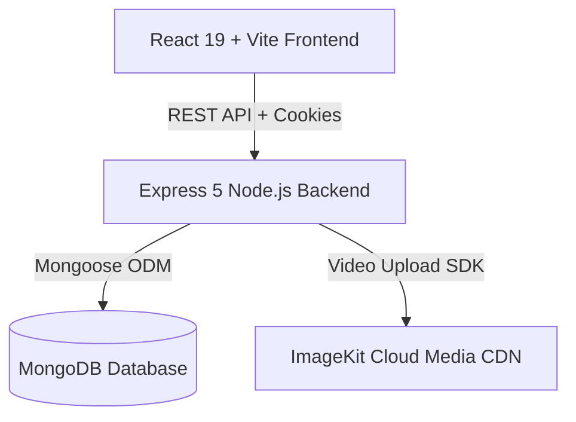

# ⚡ Reel Food — Next-Gen Short-Video Food Discovery & Partner Platform


An ultra-modern, high-performance short-form video discovery platform connecting hungry food lovers with local restaurants and culinary partners. Inspired by TikTok and Instagram Reels, **Reel Food** brings dishes to life through immersive 60fps vertical video feeds, real-time engagement, interactive store profiles, and a robust restaurant partner management system.

---

## ✨ Features at a Glance

### 📱 **User Short-Video Experience**
- **TikTok/Reels Feed**: Ultra-smooth vertical video feed with ambient blurred video mesh background and hardware-accelerated 60fps scrolling.
- **Interactive Engagement**: Real-time Like and Save buttons with animated counters, comment drawers, and quick link sharing.
- **Floating Controls**: Left & right floating control bars for quick navigation to Liked/Saved lists, prev/next reel stepping, and mute toggle.
- **Store Popup & Catalog**: View restaurant store profiles directly from any video reel, browse their video menu catalog, and initiate quick orders.
- **Liked & Saved Collections**: Dedicated pages to rewatch saved dishes and favorited food reels.
- **Logout Confirmation Modal**: Elegant glassmorphic popup modal confirming user/partner logout actions.

### 🏪 **Restaurant Partner Dashboard**
- **Secure Authentication**: Partner registration and login secured with JWT HTTP-only cookies and Bcrypt password hashing.
- **Reel Video & Item Upload**: Direct video upload integrated with **ImageKit CDN** for seamless cloud processing and global media delivery.
- **Menu Item Listing**: Manage food item titles, prices, descriptions, categories, and video reel links in real-time.

---

## 🛠️ Architecture & Tech Stack



| Layer | Technologies Used |
|---|---|
| **Frontend** | React 19, Vite, React Router DOM v7, Remix Icons (`ri-`), Modern Glassmorphism CSS |
| **Backend** | Node.js (v20+), Express.js (v5), Cookie Parser, CORS, Helmet, Morgan |
| **Authentication** | JSON Web Tokens (JWT), HTTP-Only Cookies, Bcrypt.js |
| **Database** | MongoDB (Local / Atlas), Mongoose ODM, Automated DB Seeder |
| **Media Cloud** | ImageKit Node SDK, Multer File Parser |

---

## 📁 Repository Structure

```text
reel/
├── Backend/                      # Node.js Express 5 API Server
│   ├── server.js                 # Server entry point & timeout configuration
│   ├── .env                      # Environment configurations (PORT, MongoDB, ImageKit)
│   └── src/
│       ├── app.js                # Express app setup & CORS/cookie middlewares
│       ├── controller/           # Business logic (Auth, Food, Partner, Actions)
│       ├── database/
│       │   └── a.js              # MongoDB connection & auto-seeding script
│       ├── middlewares/          # JWT authentication guard middlewares
│       ├── models/               # Mongoose Schemas (User, Partner, Food, Like, Saved)
│       ├── routes/               # API route endpoints
│       └── services/             # ImageKit cloud media upload service
│
├── Frontend/                     # React 19 Vite Web Application
│   ├── index.html                # HTML entry point with Remix Icons & Fonts
│   ├── vite.config.js            # Vite configuration
│   └── src/
│       ├── components/           # Reusable components (StoreProfileCard, etc.)
│       ├── config/               # API base URL configuration
│       ├── pages/                # App pages (Home, UserFeed, StorePage, PartnerDashboard)
│       │   ├── user/             # UserFeed, LikedReelsPage, SavedReelsPage, StorePage
│       │   └── partner/          # PartnerDashboard, PartnerLogin, PartnerRegister
│       └── index.css             # Glassmorphism design system & responsive layout
└── videos/                       # Local HD demonstration food reels
```

---

## ⚡ Quick Start Guide

### **Prerequisites**
- **Node.js** v20.0.0 or higher
- **MongoDB** running locally on port `27017` OR a **MongoDB Atlas** URI

---

### **1. Clone & Set Up Backend**

```bash
cd Backend
npm install
```

Create or verify the `.env` file inside `Backend/.env`:

```env
PORT=5000
JWT_SECRET=your_jwt_secret_key_here
MONGODB_URI=mongodb://127.0.0.1:27017/reel
IMAGEKIT_PRIVATE_KEY=your_imagekit_private_key
IMAGEKIT_PUBLIC_KEY=your_imagekit_public_key
IMAGEKIT_URL_ENDPOINT=https://ik.imagekit.io/your_endpoint
```

Start the Backend Development Server:

```bash
npm run dev
```

> **Note**: On startup, MongoDB connects automatically and seeds accurate initial food partners and video reels if the database is clean!

---

### **2. Set Up Frontend**

In a **second terminal window**:

```bash
cd Frontend
npm install
npm run dev
```

The Vite dev server will launch at:
👉 **`http://localhost:5173`**

---

## 🔌 API Endpoints Summary

### **Auth Routes (`/api/auth`)**
| Method | Endpoint | Description |
|---|---|---|
| `POST` | `/auth/user/register` | Register new user account |
| `POST` | `/auth/user/login` | User login (sets HTTP-only cookie) |
| `GET`  | `/auth/user/logout` | User logout & clear cookie |
| `POST` | `/auth/partner/register` | Register new food partner store |
| `POST` | `/auth/partner/login` | Partner store login |
| `GET`  | `/auth/partner/logout` | Partner store logout |

### **Food & Reel Routes (`/api/food`)**
| Method | Endpoint | Description |
|---|---|---|
| `GET`  | `/food/feed` | Get all video reels for user feed |
| `GET`  | `/food/my-items` | Get listed items for authenticated partner |
| `POST` | `/food/create` | Create food item & upload video reel |
| `POST` | `/food/:foodId/like` | Toggle Like status on a reel |
| `POST` | `/food/:foodId/save` | Toggle Save status on a reel |
| `GET`  | `/food/user/liked` | Get user's liked reels list |
| `GET`  | `/food/user/saved` | Get user's saved reels list |
| `GET`  | `/food/partner/:partnerId` | Get partner details and food menu catalog |

---

## 🎨 Key UI Highlights

- **Custom Logout Modal**: Modal asking *"Are you sure you want to logout?"* with *"No, Stay"* and *"Yes, Logout"* options for user and partner safety.
- **Accurate Media Alignment**: Video reels aligned with authentic dishes:
  - 🍲 **`video1.mp4`**: Hyderabadi Dum Biryani (*Royal Biryani House*)
  - 🍚 **`video2.mp4`**: Special Dum Biryani Plate (*The Biryani Express*)
  - 🍔 **`video3.mp4`**: Sizzling Double Cheese Burger (*Burger Palace*)
  - 🍹 **`video4.mp4`**: Artisanal Berry Mocktail (*The Liquid Lounge*)

---

## 🤝 Contributing

Contributions, issues, and feature requests are welcome! Feel free to check out the repository issues page.

---

## 📄 License

This project is licensed under the **ISC License**.
